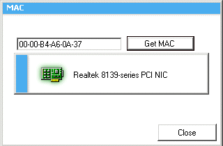



## Determining a Network Controller MAC Address Using Visual Basic

### Description

Keeping it simple, this is a wrapper routine that will return the Medium Access Control (MAC) address for the installed network card. A MAC Address is a unique 48-bit number assigned to the network interface card (NIC) by the manufacturer. MAC addresses (which are physical addresses) are used for mapping in TCP/IP network communication.
 
### More Info
 

             |
---                |---
**Submitted On**   |2001-12-11 18:53:40
**By**             |[Ismail Yurtsever](https://github.com/Planet-Source-Code/PSCIndex/blob/master/ByAuthor/ismail-yurtsever.md)
**Level**          |Intermediate
**User Rating**    |4.5 (50 globes from 11 users)
**Compatibility**  |VB 6\.0
**Category**       |[Windows API Call/ Explanation](https://github.com/Planet-Source-Code/PSCIndex/blob/master/ByCategory/windows-api-call-explanation__1-39.md)
**World**          |[Visual Basic](https://github.com/Planet-Source-Code/PSCIndex/blob/master/ByWorld/visual-basic.md)
**Archive File**   |[Determinin4112912112001\.zip](https://github.com/Planet-Source-Code/ismail-yurtsever-determining-a-network-controller-mac-address-using-visual-basic__1-29670/archive/master.zip)

